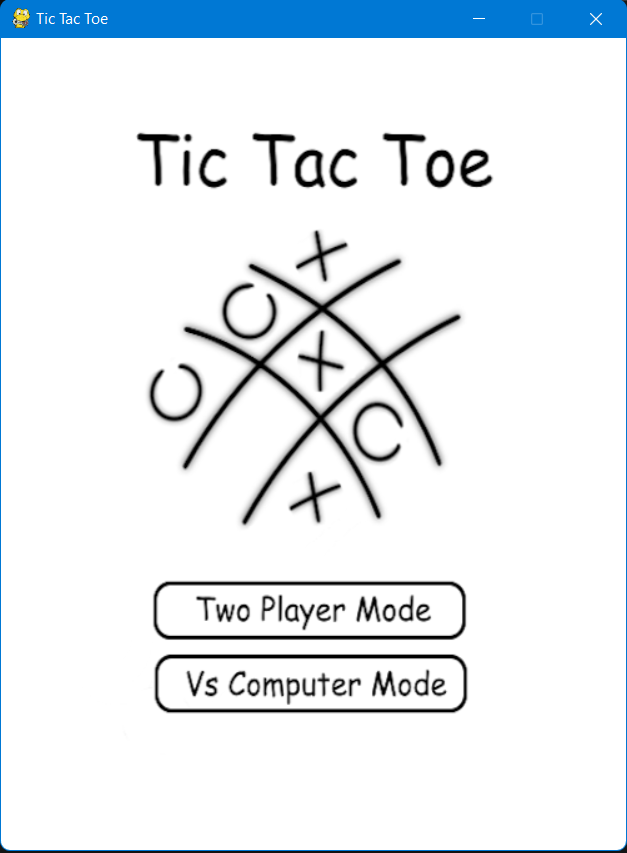
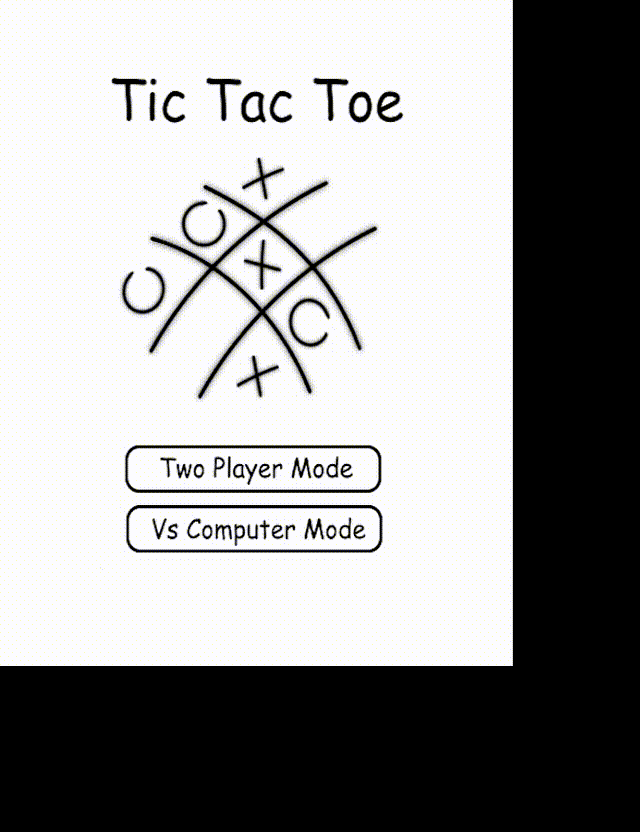

# TicTacToe Game  

This is a simple render of the classic `Tic-Tac-Toe` or `X's and O's` we all love and play. The game is made using Python3.11, however, it can be made on any python version above 3.6 and the Pygame module.

The code and assets can be used to make your own Tic-Tac-Toe game as well.

---
## Requirements:
You will obviously require the Pygame module.
<br/>
To install the pygame module:
* Open the Termina/Powershell/Command Prompt
* Run: ```pip install pygame``` or ```pip3 install pygame```
---

## To Play the Game:
Just simple extract the files in a folder, navigate to the directory and run the `tictactoe.py` file in the directory.
The home screen has two options, play against a human (two player mode) and against computer mode. However, I haven't yet implemented the computer mode so that doesn't work (if anyone has ideas to implement it in my code please feel free to suggest). Just click on the Two Player Game mode and enjoy the game with someone else. You can press Escape to return back and start the game again, or you can simple press `R` to restart the game.
<br/>
Also I'm confused on how to create a .exe file as pyinstaller does not work for me due to other packages/modules that I can't delete... so if anyone has any ideas and can help, that would be awesome.

### Home Screen


### Game Play


---

### Thank you!